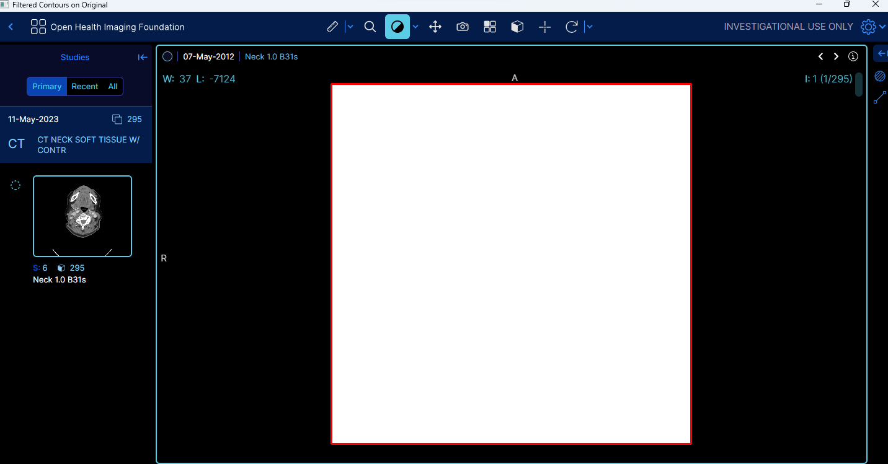

# OHIF measurement verification test

Verify measurements created in the Open Health Imaging Foundation (OHIF) zero-footprint medical image viewer.

Date: 12/19/2023

Fulmine Labs LLC

## Overview

The challenge: Due to the significant risks related to quantative measurements values, it is important to have external verifications that the values displayed by the OHIF viewer are correct.

This Python/Selenium code, run from Jupyter notebook or Jupyter lab, creates pseudo-random measurements on studies, from a list of studies that are also selected from pseudo-randomly.
Currently only length measurements are supported as a proof of concept, but this could be extended to cover other types of measurements.

For each measurement created a calculation is performed in order to calcuate the expected measurement value. The expected measurement length in millimeters (mm) is based on:
* The pixel spacing of the currently viewed DICOM image
* The scaling factors derived from the image's display size versus the number of DICOM rows and columns
* The deltas (pixel movements) from a simulated mouse interaction 
The following formula is used:

Expected Measurement Length (mm) = sqrt((Δx * Scaling Factor X * Pixel Spacing X)^2 + (Δy * Scaling Factor Y * Pixel Spacing Y)^2)

The expected result is then compared with the actual length measurement, as rendered in the browser. 
The test will pass if all lengths drawn are the same lengths as the expected lengths, within a specified tolerance. 
The tested studies and measurements are recorded in a log file with a name specific to the test run. An actual/expected comparison failure will cause an assertion falure and the test will stop.

## Current Version
The current stable version of the project is 0.1.0 See the [CHANGELOG.md](./CHANGELOG.md) for details about this version.

## Prerequisites

* Anaconda, with an environment having the Python libraries listed in [requirements.txt](./requirements.txt)
* Brave
* Chrome
* Access to the OHIF Viewer website at: https://viewer.ohif.org/

## Usage

1) Install Anaconda
2) Install the Brave and Chrome browers, if they are not already present
3) Clone the OHIF-measurement-verification-test repository to your local machine and navigate to the cloned directory in Anaconda Powershell Prompt: 'cd OHIF-measurement-verification-test'
4) Install the dependencies listed in requirements.txt with `'pip install -r requirements.txt'`
5) Open Jupyter Notebook or Jupyter Lab from Anaconda. It should start in Brave.
6) Open _OHIF-measurement-verification-test.ipynb_ from the cloned directory inside Jupyter
7) Edit any test parameters in the second cell, as needed. Currently, the following parameters can be set:
* Random _seed_ Set to _None_ for a random seed or use a seed from a previous run for repeatability. The seed is recorded in the log file for the run.
* _verbose_, True or False. True will enable logging in Jupyter Notebook, but all messages will be logged to the log file for the run.
* _study_count_ . The number of studies to select (leave action count at 1 for now).
* _study_list_. The list of studies to pick from (should be studies where we can draw the needed measurements)
* _max_length_in_screen_pixels_. The maximum size of the length measurement based on mouse movement (in screen pixels)
* _tolerance_percentage_ % Tolerance for difference between expected and actual, due to rounding
* _chrome_driver_location_ Chrome driver location
* _num_window_level_operations_ Number of times to perform window leveling (may need tuning depending on the window size of the image)
* _max_distance_ Distance in screen pixels to move the mouse when window leveling (may need tuning depending on the screen resolution)
* _OHIF_viewer_location_ 
8) In Jupyter, 'Run All Cells'

## Screenshots/Recordings

If successful the running test should look something like this:

## Testing

This code was run in Jupyter Notebook and Jupyter Lab from Anaconda 2.5.1 on Windows 11. 

The test was run from a Jupyter Lab session in Brave 1.61.104 and the target was Chrome Version 120.0.6099.110 (Official Build) (64-bit)

OHIF Worklist, Basic Viewer from https://viewer.ohif.org/, version 3.7.0.

The screen resolutions tested were:
* 1440 x 900 OK
* 1280 x 960 OK
* 1280 x 768 NOK
Below this resolution, mouse movements may be too large for the image. They can be tweaked as parameters in the second cell.

## Known issues
- Only the length measurement is currently supported. Support could be added for additional measurements following a similar methodology.
- The Browser Domain Object Model (DOM) does not offer any information regarding the image dimensions, as presumably it is being rendered server-side inside the viewport. Therefore, the challenge is to obtain the image dimensions independently of the DOM. In this version, OpenCV image processing was used to detect the image, after window levelling it. That approach appears to work well for the images selected, even after zooming the images. However it may not work for arbitrary studies with other image properties, for example images that have large window widths or RGB images. Future versions would need to be enhanced to support these types of images and harden the approach. See screenshot of image detection, (red box) below:

- Mouse movements may be out of range for some screen resolutions. The maximum sizes of mouse movements can be set in the second cell of the test as a workaround but a more robust solution could involve determing the screen resolution programmatically
- Dependencies on Brave and Jupyter could be removed in future versions. It might be desirable, for example, to run the all the existing Python/Selenium OHIF tests from the command-line using pytest
- There are common functions with the code used by the OHIF stress/fuzz test repository. It would be good to extract these as a separate python module for maintainability.

## Acknowledgements

* This code was written collaboratively with GPT-4V. Thank you Assistant!
* The Open Health Imaging Foundation [(unit and end-to-end)](https://docs.ohif.org/development/testing)

## License

[MIT open source license](LICENSE.txt)

## Collaboration

We welcome contributions at all levels of experience, whether it's with code, documentation, tests, bug reports, feature requests, or other forms of feedback. If you're interested in helping improve this tool, here are some ways you can contribute:

- **Ideas for Improvements**: Have an idea that could make the OHIF Stress Fuzz test better? Open an issue with the tag `enhancement` to start a discussion about your idea.
- **Bug Reports**: Notice something amiss? Submit a bug report under issues, and be sure to include as much detail as possible to help us understand the problem.
- **Feature Requests**: If you have a suggestion for a new feature, describe it in an issue with the tag `feature request`.
- **Documentation**: Good documentation is just as important as good code. Although this is currently a very simple tool, if you'd like to contribute documentation, we'd greatly appreciate it.
- **Code**: If you're looking to update or write new code, check out the open issues and look for ones tagged with `good first issue` or `help wanted`.

## Contact

Duncan Henderson, Fulmine Labs LLC
henderson.duncanj@gmail.com

